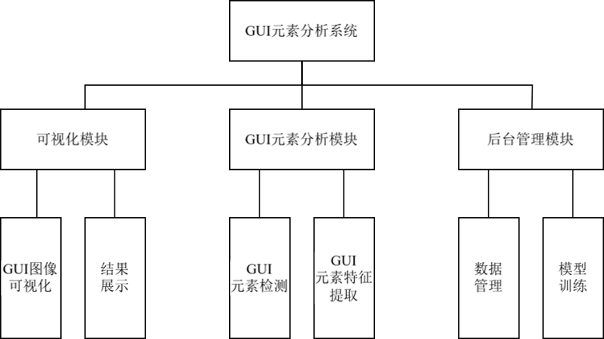

# 元素分析系统代码使用手册

## 1 系统概述

GUI元素分析系统的目标是对GUI界面中用户所感兴趣的元素进行定位与分割，获取元素图像，从而对GUI元素进行特征提取，最终获取满足代码生成任务输入要求的元素相关特征信息。

### 1.1 系统架构介绍

系统整体架构主要分为三个关键层：基础数据层、元素分析层和用户应用层。

基础数据层构建GUI元素分类数据集，并使用数据集对ResNet模型进行微调。

元素分析层按照`定位分割`→`元素分类`→`特征识别`三个阶段对GUI元素进行分析。
- `定位分割`使用SAM模型根据用户提示对GUI图像中的元素进行定位分割，得到元素图像。
- `元素分类`使用ResNet模型对元素图像进行分类，得到对应元素类别。
- `特征识别`使用OCR及计算机视觉算法根据元素类别进行特征识别，得到对应的元素特征信息。

最终将元素图像、元素类别及元素特征信息封装为结构化特征信息，实现元素分析。

### 1.2 环境配置与依赖库

运行本系统需要以下环境配置：
1. 硬件环境：
   - CPU：Intel Xeon 2.5GHz双核及以上
   - 内存：32GB及以上
   - 硬盘空间：512GB及以上
   - GPU：用于模型训练，建议NVIDIA RTX 3060及以上
2. 操作系统：CentOS 6.5及以上版本或其他兼容Linux系统
3. 基础软件环境：主要包括开发工具及编程语言环境：
   - Python 3.8
   - PyCharm、Anaconda等（开发环境）

## 2 元素分析系统运行流程简介

元素分析系统采用模块化设计，各模块之间通过统一的数据结构进行交互，使得系统可以灵活部署和扩展，如图所示。同时，系统支持整体元素分析流程执行和单独算法接口测试两种运行模式，满足不同场景下的应用需求。在接下来的章节中，我们将详细介绍整个系统的详细实现、参数配置、输入输出规范以及使用方法，帮助开发者和运维人员快速掌握系统的使用和维护。

元素分析流程分为三个阶段：`基于SAM的定位分割阶段`、`基于ResNet的元素分类阶段`、`GUI元素特征识别阶段`。

**直接运行`predictSam`接口即可实现元素分析全流程。**

系统部署及运行见[02-图分割系统代码说明文档](./02-图分割系统代码说明文档.md)。

## 3 基于SAM的定位分割阶段

### 3.1 模块功能描述

基于SAM的定位分割是整个元素分析系统的第一道关卡，其目标是根据用户对GUI图形添加的提示，对GUI元素进行定位分割，得到完整的元素图像。
本系统主要实现了三种分割方式，包括`点提示分割`、`框提示分割`、`自动分割`。根据用户在前端选择的分割方式以及添加的提示，前端将对应参数传入后端接口，后端接口根据参数自动选择分割方式。

### 3.2 主要函数定义

该函数接口设计见[03-图分割接口设计说明书](./03-图分割接口设计说明书.md)。

SAM模型存放于`sam_path`目录下，SAM源码存放于`img_seg/segment_anything`目录下，**接口函数**存放于`img_seg/imgSegAPI.py`中。主要函数如下：
- `predictSam`：
SAM推理的主要函数之一，根据提示负责将图片进行最小包络框矩形分割并返回图片信息。
- `auto_mask_generator`：
SAM推理中自动生成掩码的方法，通过`SamAutomaticMaskGenerator`类生成的`mask_generator`对象调用SAM源码中的`generate`方法生成掩码。
- `predict_mask`：
SAM推理中根据点、框提示生成掩码的方法，通过`SamPredictor`类生成的`predictor`对象调用SAM源码中的`set_image`生成掩码。

## 4 基于ResNet的元素分类阶段

GUI元素定位分割后得到GUI元素图像，对元素图像进行分类，得到对应的元素类别。本系统使用`ImageNet`预训练的`ResNet-50`，使用自建数据集对全连接层进行微调，将得到的模型用于元素分类。

### 4.1 训练资源修改

#### 4.1.1 功能概述

该数据集包含了2102张图像，每个类别70条数据左右，涵盖了30种常见的GUI元素组件类型，数据集样本分布数量如表1所示。

**表1 GUI组件统计信息**
| 组件类别 | 组件数量 | 组件类别 | 组件数量 | 组件类别 | 组件数量 |
|----------|----------|----------|----------|----------|----------|
| 文本块 | 70 | 时间选择器 | 70 | 弹框 | 70 |
| 按钮 | 73 | 评分 | 71 | 折线图 | 70 |
| 表格 | 71 | 穿梭框 | 70 | 柱状图 | 70 |
| 分页 | 70 | 进度条 | 70 | 饼图 | 72 |
| 输入框 | 70 | 导航菜单 | 70 | 雷达图 | 71 |
| 单选框 | 70 | 标签页 | 70 | 仪表盘 | 70 |
| 多选框 | 68 | 面包屑 | 70 | 散点图 | 70 |
| 选择器 | 71 | 时间线 | 65 | 热力图 | 70 |
| 开关 | 73 | 树形控件 | 71 | 关系图 | 66 |
| 滑块 | 70 | 日历 | 70 | 矩形树图 | 70 |

可以在后台管理页面对该数据集进行增删改查，查询数据时选择对应的元素类别及元素图像ID即可查看数据图像，点击“删除”按钮即可删除数据，新增数据时，上传需要新增的图像，选择其对应元素类别，即可新增数据。
训练数据存放在`img_seg/data`目录下。

#### 4.1.2 函数定义

该函数接口设计及输入输出参数见[03-图分割接口设计说明书](./03-图分割接口设计说明书.md)。

### 4.2 训练任务开始

#### 4.2.1 功能概述

使用现有元素分类数据集微调`ResNet-50`模型，可以修改训练任务超参数，包括`epoch`、`batch_size`、`lr`，异步开始训练任务，得到训练任务ID以及训练任务是否成功开始。

#### 4.2.2 函数定义

训练任务开始接口函数设计见[03-图分割接口设计说明书](./03-图分割接口设计说明书.md)。

### 4.3 训练进度查询

#### 4.3.1 功能概述

选择训练任务ID，查询对应训练任务的训练状态（等待训练、训练中、训练完成、训练已终止）、任务进度、任务类型、当前epoch、当前准确率（使用验证集准确率）。

#### 4.3.2 函数定义

训练进度查询接口函数设计见[03-图分割接口设计说明书](./03-图分割接口设计说明书.md)。

### 4.4 训练任务终止

#### 4.4.1 功能概述

由于训练任务是异步执行的，需要终止训练任务时，可以使用此功能，避免浪费训练资源。

#### 4.4.2 函数定义
训练任务终止接口函数设计见[03-图分割接口设计说明书](./03-图分割接口设计说明书.md)。

## 5 GUI元素特征识别阶段

### 5.1 模块功能描述

在构造的30类GUI元素分类数据集中，通过分析主流前端框架（`React`、`Vue`）的代码模板，筛选出17类需提取内部特征的关键元素，并定义其对应的8种核心特征属性。8种属性特征分别为组件颜色、边框颜色、圆角幅度、文字块相关信息（文本内容、字体颜色、字体大小、字体行高和对齐方向）。各元素特征信息如表2所示。
系统根据元素类别，选择对应的特征识别模块，提取元素特征信息，返回结构化的特征信息。

**表2 组件特征信息统计**
| 编号 | 组件名称 | 需要提取的特征信息 |
|------|----------|--------------------|
| 1 | 文本块 | 文字块相关信息 |
| 2 | 按钮 | 组件颜色、边框颜色、圆角幅度、文字块相关信息 |
| 3 | 分页 | 文字块相关信息 |
| 4 | 输入框 | 边框颜色、圆角幅度、文字块相关信息 |
| 5 | 表格 | 文字块相关信息 |
| 6 | 单选框 | 组件颜色、文字块相关信息 |
| 7 | 多选框 | 组件颜色、文字块相关信息 |
| 8 | 选择器 | 边框颜色、圆角幅度、文字块相关信息 |
| 9 | 开关 | 组件颜色、文字块相关信息 |
| 10 | 滑块 | 组件颜色 |
| 11 | 时间选择器 | 边框颜色、文字块相关信息 |
| 12 | 评分 | 组件颜色 |
| 13 | 进度条 | 组件颜色 |
| 14 | 导航菜单 | 组件颜色、文字块相关信息 |
| 15 | 标签页 | 文字块相关信息 |
| 16 | 面包屑 | 文字块相关信息 |
| 17 | 时间线 | 文字块相关信息 |

### 5.2 主要函数定义

函数存放于`img_seg/imgSegAPI.py`中。主要函数如下：
- `get_component_info`：获取GUI元素特征总函数，根据ResNet预测的组件类型选择识别其中需要识别的特征。
- `get_text_info`：获取输入图片中的文字信息，包括文字块坐标、内容、文字颜色和背景色。
- `get_edge_colors`、`get_outer_edge_color`、`get_avg_border_color`：获取输入图片边缘的背景颜色。
- `get_line_height`：根据输入的文字信息计算得到文字排列方式和行高。
- `get_table_header_info`：获取表头的文字信息，包括文字块坐标、字段列长度和颜色等。
- `has_rounded_corners`、`get_round_corner_height`：获取GUI元素的圆角及圆角幅度。

## 文档修订记录

| 修订版本号 | 修订人 | 修订日期 | 修订描述 |
|-----------|--------|----------|----------|
| v1.0 | 陈家伟 | 2026-01-21 | 整理元素分析系统代码 |

---

**文档版本**: v1.0
**最后更新**: 2026-01-21
**对应系统版本**: 图分割系统
