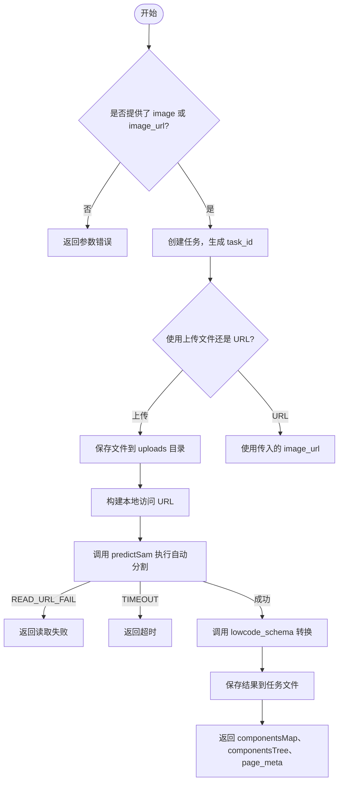
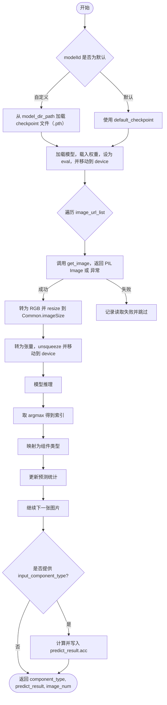
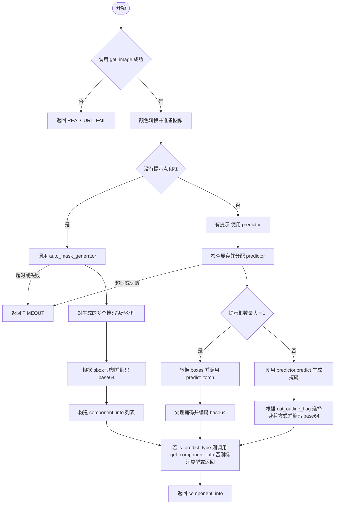
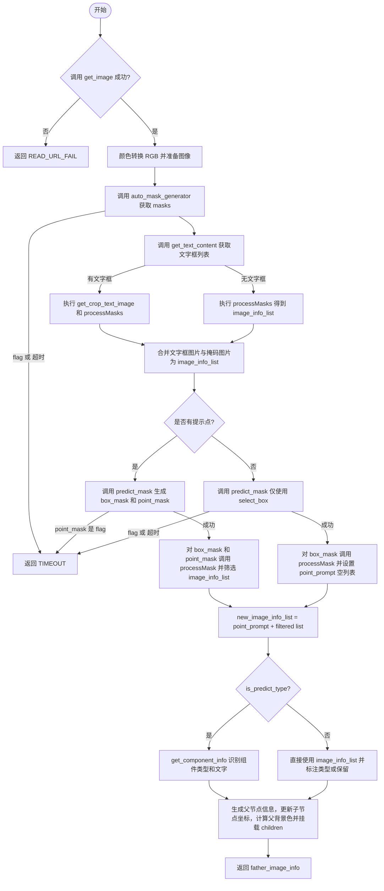
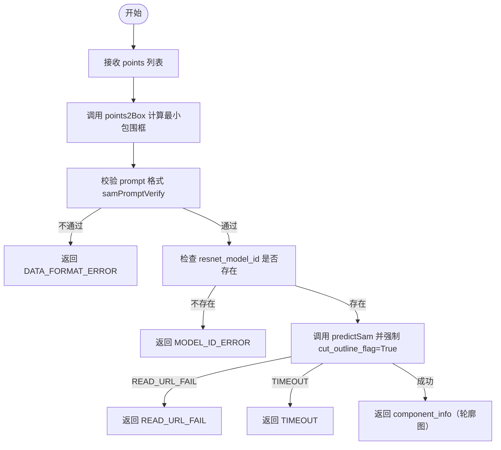
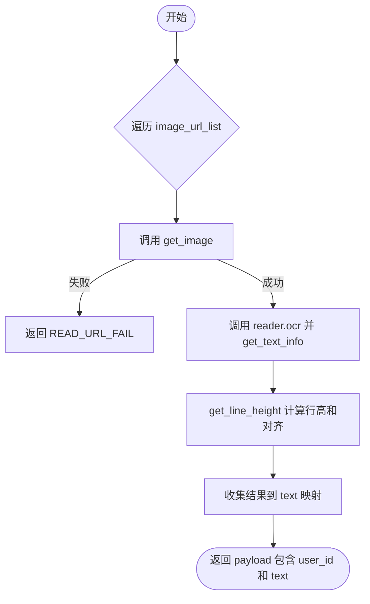

# 图分割接口设计说明书

## 接口框架结构

## 入料识别接口（3个接口）

#### 1. 获取上传的文件

- **接口名称**: serve_upload
- **请求路径**: `/uploads/{filename}`
- **请求方式**: GET
- **功能描述**: 获取通过 ingest 接口上传的文件，支持图片回显

**成功返回示例：**
返回文件内容（二进制），Content-Type 根据文件类型自动识别。

**错误返回示例：**
```json
{
    "detail": "file not found"
}
```

---

#### 2. 入料并识别（同步MVP）

- **接口名称**: ingest
- **请求路径**: `/ingest`
- **请求方式**: POST (multipart/form-data)
- **功能描述**: 上传图片或指定图片URL，执行 SAM 自动分割 + ResNet 组件分类，返回 componentsMap 与 componentsTree

|**基本结构示例：**
|**示例入参（multipart/form-data）：**
| 参数 | 类型 | 必填 | 说明 |
|------|------|------|------|
| image | File | 否 | 上传的图片文件，与 image_url 二选一 |
| image_url | string | 否 | 图片 URL，与 image 二选一 |
| user_id | string | 否 | 用户 ID，默认为 "anonymous" |

**成功返回示例：**
```json
{
    "code": 100,
    "status": 200,
    "message": "成功",
    "payload": {
        "task_id": "ingest_abc123-def456",
        "task_status": 200,
        "components_map": {
            "Button-1": {
                "component_name": "Button-1",
                "component_type": "Button",
                "props": {
                    "style": {
                        "left": 100,
                        "top": 200,
                        "width": 120,
                        "height": 40
                    }
                }
            }
        },
        "components_tree": {
            "id": "page",
            "children": [...]
        },
        "page_meta": {
            "width": 1920,
            "height": 1080
        }
    }
}
```

**错误返回示例：**
```json
{
    "code": -3000,
    "status": 400,
    "message": "失败",
    "payload": {
        "err": 801,
        "task_id": "ingest_abc123-def456"
    }
}
```

**task_status 字段含义：**
```json
200  正常结束
300  进行中
400  异常终止
```

**err 含义：**
```json
801：读取 URL 图片失败
802：超时
808：未知异常
```

---

#### 3. 查询 ingest 任务状态

- **接口名称**: ingest_status
- **请求路径**: `/ingest/status`
- **请求方式**: GET
- **功能描述**: 查询 ingest 异步任务的执行状态和结果
|**基本结构示例：**
|**示例入参（query parameters）：**
| 参数 | 类型 | 必填 | 说明 |
|------|------|------|------|
| task_id | string | 是 | ingest 接口返回的任务 ID |

**成功返回示例：**
```json
{
    "code": 100,
    "status": 200,
    "message": "成功",
    "payload": {
        "task_id": "ingest_abc123-def456",
        "task_status": 200,
        "created_at": "2026-01-26 10:30:00",
        "finished_at": "2026-01-26 10:30:05",
        "result": {
            "components_map": {...},
            "components_tree": {...},
            "page_meta": {...}
        }
    }
}
```

**任务进行中示例：**
```json
{
    "code": 100,
    "status": 200,
    "message": "成功",
    "payload": {
        "task_id": "ingest_abc123-def456",
        "task_status": 300,
        "created_at": "2026-01-26 10:30:00"
    }
}
```

**错误返回示例：**
```json
{
    "code": -3000,
    "status": 404,
    "message": "失败",
    "payload": {
        "err": 803,
        "task_id": "ingest_abc123-def456"
    }
}
```

**err 含义：**
```json
803：任务 ID 不存在
```

## ResNet推理接口（1个接口）

#### 1. ResNet推理api

**接口名称**: predictResnet
**请求路径**: `/imgSeg/v1/predictResnet`
**功能描述**: 获取图像用ResNet推理图像组件类型，支持批量处理

**基本结构示例：**
**示例入参：**
```json
{
    "image_url_list":[
        "https://img1.baidu.com/it/u=3848756526,1882598275&fm=253&fmt=auto&app=138&f=JPEG?w=888&h=500",
        "https://img.zcool.cn/community/0181445f0194b9a801215aa00b682d.png?x-oss-process=image/auto-orient,1/resize,m_lfit,w_1280,limit_1/sharpen,100"
    ], // 组件图片的URL列表
    "model_id":"Train-imgSeg-3e8e29da-6e42-4d2d-961c-4e95f562b6ad",  //resnet目前的默认模型ID，训练模块API返回的checkPointName。若调用方不给modelID，则调用默认的训练模型
    "topic_id": "12345",
    "user_id": "user_0629_01"
}
```
> **使用默认模型: 入参中model_id为空字符串或者不用传入model_id** 

**成功返回示例：**
```json
{
    "code": 100,
    "status": 200,
    "message": "成功",
    "payload": {
        "task_id": "resnetPredict_a01f27b8-1b05-11ee-921c-7404f1a2c25d",
        "task_status": 300,
        "topic_id": "12345",     //调用方传入，在返回结果中返回给调用方
        "user_id": "user_0629_01"//调用方传入，在返回结果中返回给调用方
    }
}

{
    "code": 100,
    "status": 200,
    "message": "成功",
    "payload": {
        "task_id": "resnetPredict_a01f27b8-1b05-11ee-921c-7404f1a2c25d",
        "task_status": 200,
        "component_type": {
            "https://img1.baidu.com/it/u=3848756526,1882598275&fm=253&fmt=auto&app=138&f=JPEG?w=888&h=500": "Button",
            "https://img.zcool.cn/community/0181445f0194b9a801215aa00b682d.png?x-oss-process=image/auto-orient,1/resize,m_lfit,w_1280,limit_1/sharpen,100": "Button"
        }, 
        "predict_result": {
            "Button": 1.0,
            "Text": 2.0
        },
        "image_num": 2,
        "topic_id": "12345",
        "user_id": "user_0629_01"
    }
    }
}
```
**错误返回示例：**
```json
{
    "code": -3000,
    "status": 404,
    "message": "失败",
    "payload": {
        "err": 805,
        "topic_id": "12345",     //调用方传入，在返回结果中返回给调用方
        "user_id": "user_0629_01"//调用方传入，在返回结果中返回给调用方
    }
}
```
**err含义:**
```json
805：模型ID输入错误（id不存在）
```

## SAM推理接口（3个接口）

#### 1. SAM1

**接口名称**: predictSam
**请求路径**: `/imgSeg/v1/predictSam`
**功能描述**: 获取图像用SAM推理图像组件类型，支持批量处理

**基本结构示例：**
**示例入参：**
```json
{
    "image_url":"https://img.zcool.cn/community/0181445f0194b9a801215aa00b682d.png?x-oss-process=image/auto-orient,1/resize,m_lfit,w_1280,limit_1/sharpen,100",
    "prompt": {
        "input_point": [[800,750]],
        "input_label": [1],
        "input_box": []
    },
    "topic_id": "12345",
    "user_id": "user_0629_01",
    "is_predict_type": true,    //判断SAM分割的同时是否预测所分割图片的组件类型 默认为false不预测
    "resnet_model_id": "Train-imgSeg-3e8e29da-6e42-4d2d-961c-4e95f562b6ad" , //可不传入，resnet目前的默认模型ID。
    "read_text_component_list":["Button"] //需要识别其中文字的组件类型列表。可不传入，默认为空
  }
}
```

**成功返回示例：**
```json
{
    "code": 100,
    "status": 200,
    "message": "成功",
    "payload": {
        "task_id": "samPredict_c401002a-1ae9-11ee-aecb-7404f1a2c25d",
        "task_status": 200,
// 组件信息列表，键值包括"top_left_coord"，"width"，"height"，"img_component_base64"，"text"，"component_type"，注意如果开始sam推理中没有传入prompt点框坐标提示，component_info只会包括前五个键值（也就是没有"text"和"component_type"），因为如果不给提示预测出的掩码是非常多的，分割的图片会重复且部分图片分割效果不好，预测组件类型和提取文字绝大多数也会效果不好，因而无论是否传入了is_predict_type为true和read_text_component_list都不会预测组件类型和提取文字。
        "component_info": [{
            "top_left_coord": [682,742],
            "width": 207,
            "height": 59,
            "rgb_mean": [37,128,254],
            "img_component_base64": xxx, // 图像的base64编码
            "text":["完成"],  //图像中的文字，字符串列表形式
            "component_type":"Button"  //组件类型是Button在传入参数read_text_component_list列表中，text键值是一个文字列表，如果组件类型不在传入参数read_text_component_list中，text键值为空
          }],
        "topic_id": "12345",     //调用方传入，在返回结果中返回给调用方
        "user_id": "user_0629_01" //调用方传入，在返回结果中返回给调用方
    }
}
```
**错误返回示例：**
```json
{
    "code": -3000,
    "status": 404,
    "message": "失败",
    "payload": {
        "err": 806,
        "topic_id": "12345",     //调用方传入，在返回结果中返回给调用方
        "user_id": "user_0629_01"//调用方传入，在返回结果中返回给调用方
    }
}
```
**task_status字段含义：**
```json
    200 正常结束
    400 异常终止
```
**err含义:**
```json
806：输入的prompt格式错误
```

#### 2. SAM2

- **接口名称**: predictSam2
- **请求路径**: `/imgSeg/v1/predictSam2`
- **功能描述**: 针对SAM自动分割生成图片过多并且生成图片大部分不可用的情况，以及分割组件时需要多次框选，使用较为繁琐的问题，我们对SAM分割部分进行了优化，实现了对自动分割生成图片的过滤，并且可以添加点提示，将需要的组件进行分割，解决了上述问题。

**基本结构示例：**
**示例入参：**
```json
{
    "image_url":"https://img.zcool.cn/community/0181445f0194b9a801215aa00b682d.png?x-oss-process=image/auto-orient,1/resize,m_lfit,w_1280,limit_1/sharpen,100",
    "prompt": {
        "input_point": [[800,750]],     //点分割坐标
        "input_label": [1],
    },
    "select_box": [995,341,1662, 719],
    "topic_id": "12345",
    "user_id": "user_0629_01",
    "is_predict_type": false,
    "resnet_model_id": "string",
    "read_text_component_list": [],
    "cut_outline_flag": false
}
```
**成功返回示例：**
```json
{
    "code": 100,
    "status": 200,
    "message": "成功",
    "payload": {
        "task_id": "samPredict_c401002a-1ae9-11ee-aecb-7404f1a2c25d",
        "task_status": 200,
// 组件信息列表，键值包括"top_left_coord"，"width"，"height"，"img_component_base64"，"text"，"component_type"，注意如果开始sam推理中没有传入prompt点框坐标提示，component_info只会包括前五个键值（也就是没有"text"和"component_type"），因为如果不给提示预测出的掩码是非常多的，分割的图片会重复且部分图片分割效果不好，预测组件类型和提取文字绝大多数也会效果不好，因而无论是否传入了is_predict_type为true和read_text_component_list都不会预测组件类型和提取文字。
        "component_info": [{
           "top_left_coord": [682,742],
        "width": 207,
        "height": 59,
        "rgb_mean": [37,128,254],
        "img_component_base64": xxx, // 图像的base64编码
        "text":["完成"],  //图像中的文字，字符串列表形式
        "component_type":"Button"  //组件类型是Button在传入参数read_text_component_list列表中，text键值是一个文字列表，如果组件类型不在传入参数read_text_component_list中，text键值为空
          }],
        "topic_id": "12345",     //调用方传入，在返回结果中返回给调用方
        "user_id": "user_0629_01"//调用方传入，在返回结果中返回给调用方
    }
}
```

**错误返回示例：**
```json
{
    "code": -3000,
    "status": 404,
    "message": "失败",
    "payload": {
        "err": 806,
        "topic_id": "12345",     //调用方传入，在返回结果中返回给调用方
        "user_id": "user_0629_01"//调用方传入，在返回结果中返回给调用方
    }
}
```
**task_status字段含义：**
```json
    200 正常结束
    400 异常终止
```
**err含义:**
```json
806：输入的prompt格式错误
```

#### 3. SAM3

- **接口名称**: predictSam3
- **请求路径**: `/imgSeg/v1/predictSam3`
- **功能描述**: 前端使用套索选择想要分割的区域，后端对套索的点坐标进行处理后，得到SAM框选分割功能能够使用的参数（套索的点坐标形成的框的左上角和右下角坐标），使用SAM框选分割功能对其进行推理分割，返回轮廓图。


**基本结构示例：**
**示例入参：**
```json
{
  "image_url": "https://example.com/page.png",
  "points": [[100,100],[200,150],[180,300]],
  "prompt": {
    "input_point": [],
    "input_label": []
  },
  "topic_id": "12345",
  "user_id": "user_0629_01",
  "is_predict_type": false,
  "resnet_model_id": "Train-imgSeg-xxxx",
  "read_text_component_list": []
}
```
**成功返回示例：**
```json
{
  "code": 100,
  "status": 200,
  "message": "成功",
  "payload": {
    "task_id": "samPredict_xxx",
    "task_status": 200,
    "component_info": [{
      "left_top_coord": [95, 95],
      "width": 110,
      "height": 210,
      "rgb_mean": [230, 230, 230],
      "img_component_base64": "iVBORw0KGgoAAAANS...",
      "component_type": "Image"
    }],
    "topic_id": "12345",
    "user_id": "user_0629_01"
  }
}
```
**错误返回示例：**
```json
{
  "code": 100,
  "status": 200,
  "message": "成功",
  "payload": {
    "err": "READ_URL_FAIL",
    "task_id": "samPredict_xxx",
    "task_status": 400,
    "topic_id": "12345",
    "user_id": "user_0629_01"
  }
}
```

## OCR文字识别接口（1个接口）

#### 1. OCR文字识别api

- **接口名称**: predictText
- **请求路径**: `/imgSeg/v1/predictText`
- **功能描述**: 开始OCR文字识别推理，提取图片中的文字内容和位置信息。

**基本结构示例：**
**示例入参：**
```json
{
    "user_id": "user_0629_01",
    "image_url_list":[
        "https://img1.baidu.com/it/u=3848756526,1882598275&fm=253&fmt=auto&app=138&f=JPEG?w=888&h=500",
        "https://img.zcool.cn/community/0181445f0194b9a801215aa00b682d.png?x-oss-process=image/auto-orient,1/resize,m_lfit,w_1280,limit_1/sharpen,100"
    ]
}
```
**成功返回示例：**
```json
{
    "code": 100,
    "status": 200,
    "message": "成功",  
    "payload": {
    "user_id": "user_0629_01",
    "text": {
      "https://example.com/img1.png": [
        {
          "left_top_coord": [10, 20],
          "width": 120,
          "height": 24,
          "msg": "提交申请",
          "backgroundColor": [49, 97, 245],
          "color": [255, 255, 255],
          "line_height": 28
        },
        {
          "align": "left"
        }
      ],
      "https://example.com/img2.png": []
    }
    }
}
```
**错误返回示例：**
```json
{
    "code": -3000,
    "status": 404,
    "message": "失败",
    "payload": {
        "err": "601",
        "user_id": "user_0629_01"//调用方传入，在返回结果中返回给调用方
    }
}
```
**err含义:**
```json
601：url图片数据不合规
```

## 训练相关接口（4个接口） 

#### 1. 开始训练api

**基本结构示例：**
**示例入参：**
```json
{
    "user_id": "xxx",       // 传入什么使用什么，例如user_0629_01
    "task_type": "train",   // 任务类型
    "train_params": {       // 训练参数
        "epochs": 10,       // 训练轮数
        "batch_size":8,     // 每批次训练数据量，建议8的倍数
        "learning_rate": 0.001 // 学习率
    }
}
```
**成功返回示例：**
```json
{
    "code": 100,
    "status": 200,
    "message": "成功",
    "payload": {
        "train_task_id": "Train-imgseg-7de43a30-fa97-4da2-ace6-ebbc4746bd0f",  // 任务id 命令格式：任务类型(Infr/Train)-随机码
        "task_type": "train",  // 任务类型
        "user_id": "xxx",      // 传入什么使用什么，例如user_0629_01
        "task_status": 300     // 任务状态
    }
}
```
**失败返回示例：**
```json
{
    "code": -3000,
    "status": 404,
    "message": "失败",
    "payload": {
        "err": 800,         // 错误类型
        "user_id": "xxx",   // 传入什么使用什么，例如user_0629_01
        "task_type": "train"  // 任务类型
    }
}
```

#### 2. 查询训练api

**基本结构示例：**
**示例入参：**
```json
{
    "train_task_id": "Train-imgseg-96f219f8-5653-4c1b-a4b4-0a92467a27d4", // 任务id
    "user_id": "xxx", // 用户id
    "task_type": "train"  // 任务类型
}
```
**成功返回示例：**
```json
{
    "code": 100,
    "status": 200,
    "message": "成功",
    "payload": {
        "train_task_id": "Train-imgseg-96f219f8-5653-4c1b-a4b4-0a92467a27d4", 
        "user_id": "user_0629_01",
        "task_type": "train",  //任务类型
        "task_status": 300,  //任务状态，正在训练中
        "acc": 0.95,        //当前训练保存的模型的验证集准确率
        "loss": 0.11,        //当前训练保存的模型的验证集平均损失
        "epoch": 15,        //当前训练的轮数，正在训练第15轮
        "modelEpoch": 12,        //当前保存的模型是第12轮训练保存的模型
        "labels": ["Bar","Input",...],   //模型识别的组件类型列表
        "singleAcc": [0.8,1,...],    //当前保存的模型各组件验证集准确率列表(Bar准确率0.8，Input准确率1)
        "dataset_num": 585,      //数据集总数量
        "valAccList": [0.728,0.831,...],  //训练过程中每一轮模型的验证集准确率列表，第一轮模型的准确率0.728,第二轮0.831...
        "valLossList": [1.578,0.547,...]  //训练过程中每一轮模型的验证集平均损失列表，第一轮模型的平均损失1.578,第二轮0.547...
    }
}
```
**失败返回示例：**
```json
{
    "code": -3000,
    "status": 404,
    "message": "失败",
    "payload": {
        "err": 803,  //错误类型
        "train_task_id": "Train-imgseg-7de43a30-fa97-4da2-ace6-ebbc4746bd0f",  //任务id 命令格式：任务类型(Infr/Train)-随机码
        "user_id": "xxx",  //传入什么使用什么，例如user_0629_01
        "task_type": "train",  //任务类型
    }
}
```

#### 3. 终止训练api

**基本结构示例：**
**示例入参：**
```json
{
    "train_task_id": " Train-imgseg-96f219f8-5653-4c1b-a4b4-0a92467a27d4",  //任务id 命令格式：任务类型(Infr/Train)-随机码
    "user_id": "xxx",  //传入什么使用什么，例如user_0629_01
    "task_type": "train" //任务类型
}
```
**成功返回示例：**
```json
{
    "code": 100,
    "status": 200,
    "message": "成功",
    "payload": {
        "train_task_id": "Train-imgseg-96f219f8-5653-4c1b-a4b4-0a92467a27d4",  //任务id 命令格式：任务类型(Infr/Train)-随机码
        "user_id": "user_0629_01", //传入什么使用什么，例如user_0629_01
        "task_type": "train", //任务类型
        "task_status": 500
    }
}
```
**失败返回示例：**
```json
{
    "code": -3000,
    "status": 404,
    "message": "失败",
    "payload": {
        "err": 803,  //错误类型
        "train_task_id": "Train-imgseg-7de43a30-fa97-4da2-ace6-ebbc4746bd0f",  //任务id 命令格式：任务类型(Infr/Train)-随机码
        "user_id": "xxx",  //传入什么使用什么，例如user_0629_01
        "task_type": "train",  //任务类型
    }
}
```

#### 4. ResNet训练资源增加api

**基本结构示例：**
**示例入参：**
```json
{
    "user_id": "user_0630_1",   //用户信息 
    "dataset":{
        "imgseg_1": {
            "url": "url1",
            "component_type": "Input"
        },
        "imgseg_2": {
            "url": "url2",
            "component_type": "Button"
        }
    }
}
```
**成功返回示例：**
```json
{
     "code": 100,  //成功
     "status": 200,  //成功
     "message": "成功",
     "payload": {
        "user_id": "user_0630_1",
        "get_info": {
            "imgseg_1": 900,
            "imgseg_2": 900
        }
    }
}
```
**错误返回示例：**
```json
{
    "code": -3000,
    "status": 400,
    "message": "失败",
    "payload": {
        "user_id": "user_0630_1",
        "get_info": {
            "imgseg_1": 902,
            "imgseg_2": 601
        }
    }
}
```

## 图像分析接口

## 返回码汇总

| 返回码	| 错误代码	| 表示 |
|---------|---------|---------|
| code	| 200	| 一般性的成功返回 |
|- |  201	| 资源被创建 |
|- | 100	| 成功 |
|- | -1001	| 用户名或密码错误 |
|- | -1002	| 用户不存在 |
|- | -1003	| 用户未登录 |
|- | -3000	| 参数传递错误 |
|- | -10000	| 文件上传错误 |
|- | -10001	| 找不到文件 |
|- | -10002	| 转码异常 |
|- | -10003	| 文件IO异常 |
|- | -10006	| 参数传递不足 |
|- | -10013	| 保存错误 |
|- | -10014	| 操作错误 |
|- | -10015	| 工作流异常 |
|status	| 200	| 一般性的成功返回 |
| - | 201	| 资源被创建 |
| - | 202	| 仅表示请求已经收到 |
| - | 204	| 此状态可能会出现在PUT、POST、DELETE的请求中，表示资源存在，但消息体中不会返回任何资源相关的状态或信息 |
| - | 301	| 资源的URL被转移，需要使用新的URL访问 |
| - | 302	| 应该只在GET/HEAD方法下使用， |
| - | 303	| 返回一个资源地址 |
| - | 304	| 资源与客户端最近访问的资源版本一致 |
| - | 307	| URI临时性重定向到另外一个URI |
| - | 400	| 客户端一般性错误返回 |
| - | 401	| 访问需要验证的资源时，验证错误 |
| - | 403	| 非验证性资源访问被禁止 |
| - | 404	| 找不到URI对应的资源 |
| - | 405	| HTTP的方法不支持 |
| - | 406	| 客户端所请求的资源数据格式类型给不被支持 |
| - | 409	| 资源状态冲突 |
| - | 412	| 有条件的操作不被满足时返回 |
| - | 415	| 客户端支持的数据类型，服务端无法满足 |
| - | 500	| 服务器端接口错误 |
|taskStatus	| 200	| 正常结束 |
| - | 300	| 正在进行中 |
| - | 400	| 异常终止 |
| - | 500	| 被用户手动终止 |
| error	| 800	| 当前有训练任务正在进行，创建训练任务失败 |
| - | 801	| 读取url图像数据失败 |
| - | 802	| 超时 |
| - | 803	| 任务ID不存在 |
| - | 804	| 用户ID不存在 |
| - | 805	| 模型ID输入错误 |
| - | 806	| 数据格式错误 |
| - | 807	| 参数不合法 |
| - | 808	| 未知异常 |
validStatus	| 600	| url图像数据和类型type均为合规数据 |
| - | 601	| url图像数据不合规 |
| - | 602	| Type不合规 |
| - | 603	| url图像数据和type均为不合规数据 |
| getTrainDataStatus	| 900	| 单条数据新增成功 |
| - | 901	| 单条数据url或component_type名称错误 |
| - | 902	| 单条数据url图像读取失败 |

## 文档修订记录

| 修订版本号 | 修订人 | 修订日期 | 修订描述 |
|-----------|--------|----------|----------|
| v1.2 | 陈家伟 | 2026-01-26 | 补充生成组件列表 api |
| v1.1 | gaowei | 2026-01-22 | 补充 SAM 各接口流程图与示例，统一 component_info 格式，更新 OCR 返回示例 |
| v1.0 | 陈家伟 | 2026-01-21 | 整理所有API接口规范 |

---

**文档版本**: v1.2
**最后更新**: 2026-01-26
**对应系统版本**: 图分割系统
