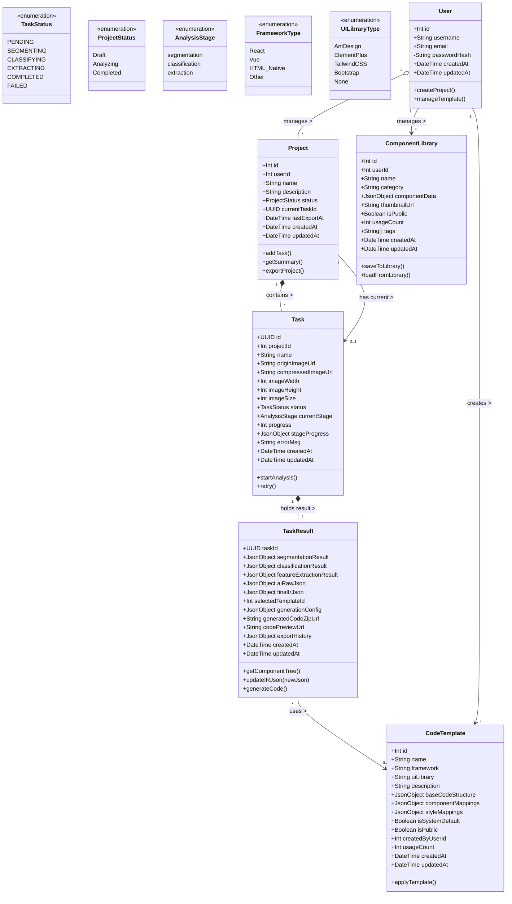

# 数据库设计

## 数据库设计方案

## 核心实体关系图 (ERD) 简述

* **User (用户)**：系统的核心主体。
* **Project (项目)**：用户创建的顶层目录，支持状态管理和中间结果导出。
* **Task (任务/作品)**：具体的分析单元，支持多阶段AI分析过程。
* **TaskResult (任务结果)**：存储 AI 分析、人工修正和代码生成的全过程数据。
* **Template (模板)**：代码生成的基架，支持多种技术栈和组件库。
* **ComponentLibrary (组件库)**：用户自定义组件的存储和管理，便于复用。

## 详细数据表设计

### 1. 用户体系

* 表名: `users` (用户表)
描述：存储用户的基本信息和认证信息。**已移除会员相关字段。**

| 字段名 | 数据类型 (PostgreSQL) | 说明 | 约束 |
| --- | --- | --- | --- |
| `id` | SERIAL | 用户唯一 ID | PRIMARY KEY |
| `username` | VARCHAR(50) | 用户名 | UNIQUE, NOT NULL |
| `email` | VARCHAR(100) | 邮箱地址 | UNIQUE, NOT NULL |
| `password_hash` | VARCHAR(255) | 加密后的密码 | NOT NULL |
| `created_at` | TIMESTAMP | 注册时间 | DEFAULT NOW() |
| `updated_at` | TIMESTAMP | 最后更新时间 | DEFAULT NOW() |

### 2. 项目与作品

* 表名: `projects` (项目表)
描述：用于管理和组织用户的多个作品，支持项目状态管理和中间结果导出。

| 字段名 | 数据类型 | 说明 | 约束 |
| --- | --- | --- | --- |
| `id` | SERIAL | 项目唯一 ID | PRIMARY KEY |
| `user_id` | INTEGER | 所属用户 ID | FOREIGN KEY (`users.id`), NOT NULL |
| `name` | VARCHAR(100) | 项目名称 | NOT NULL |
| `description` | TEXT | 项目描述 |  |
| `status` | VARCHAR(20) | 项目状态 | Draft, Analyzing, Completed, DEFAULT 'Draft' |
| `current_task_id` | VARCHAR(36) | 当前活跃任务ID | FOREIGN KEY (`tasks.id`) |
| `last_export_at` | TIMESTAMP | 最后导出时间 |  |
| `created_at` | TIMESTAMP | 创建时间 | DEFAULT NOW() |
| `updated_at` | TIMESTAMP | 最后更新时间 | DEFAULT NOW() |

* 表名: `tasks` (作品表)
描述：存储每一次 UI 分析任务的基本信息和多阶段分析状态。

| 字段名 | 数据类型 | 说明 | 约束 |
| --- | --- | --- | --- |
| `id` | VARCHAR(36) | 任务唯一 ID (UUID) | PRIMARY KEY |
| `project_id` | INTEGER | 所属项目 ID | FOREIGN KEY (`projects.id`), NOT NULL |
| `name` | VARCHAR(100) | 任务名称 | NOT NULL |
| `origin_image_url` | VARCHAR(255) | 原始上传的 UI 图片 URL | NOT NULL |
| `compressed_image_url` | VARCHAR(255) | 预处理后的压缩图 URL |  |
| `image_width` | INTEGER | 原始图片宽度 |  |
| `image_height` | INTEGER | 原始图片高度 |  |
| `image_size` | INTEGER | 图片文件大小(字节) |  |
| `status` | VARCHAR(20) | 任务状态 | PENDING, SEGMENTING, CLASSIFYING, EXTRACTING, COMPLETED, FAILED |
| `current_stage` | VARCHAR(20) | 当前分析阶段 | segmentation, classification, extraction |
| `progress` | INTEGER | 当前进度百分比 (0-100) | DEFAULT 0 |
| `stage_progress` | JSONB | 各阶段详细进度 |  |
| `error_msg` | TEXT | 若失败，存储错误信息 |  |
| `created_at` | TIMESTAMP | 创建时间 | DEFAULT NOW() |
| `updated_at` | TIMESTAMP | 最后状态更新时间 | DEFAULT NOW() |

* 表名: `task_results` (任务结果表)
描述：存储 AI 分析、人工修正和代码生成的全过程数据，与 `tasks` 是一对一关系。

| 字段名 | 数据类型 | 说明 | 约束 |
| --- | --- | --- | --- |
| `task_id` | VARCHAR(36) | 关联的任务 ID | PRIMARY KEY, FOREIGN KEY (`tasks.id`) |
| `ai_raw_json` | JSONB | AI自动化分析生成的页面级 schema JSON（遵循 `assets/schema.json` 格式），用于存储自动化分析结果 |  |
| `final_ir_json` | JSONB | **核心字段**。人工修正后的完整schema格式JSON |  |
| `selected_template_id` | INTEGER | 生成代码时使用的模板 ID | FOREIGN KEY (`code_templates.id`) |
| `generation_config` | JSONB | 代码生成配置（技术栈、组件库选择等） |  |
| `generated_code_zip_url` | VARCHAR(255) | 最终生成的代码压缩包下载地址 |  |
| `code_preview_url` | VARCHAR(255) | 代码预览文件URL（便于前端展示） |  |
| `export_history` | JSONB | 导出历史记录 |  |
| `created_at` | TIMESTAMP | 创建时间 | DEFAULT NOW() |
| `updated_at` | TIMESTAMP | 更新时间 | DEFAULT NOW() |

### 3. 组件库

* 表名: `component_library` (组件库表)
描述：存储用户自定义的组件组合，便于复用和分享。

| 字段名 | 数据类型 | 说明 | 约束 |
| --- | --- | --- | --- |
| `id` | SERIAL | 组件唯一 ID | PRIMARY KEY |
| `user_id` | INTEGER | 创建者用户 ID | FOREIGN KEY (`users.id`), NOT NULL |
| `name` | VARCHAR(100) | 组件名称 | NOT NULL |
| `category` | VARCHAR(50) | 组件分类 | Button, Input, Layout, etc. |
| `component_data` | JSONB | 组件完整数据（包含属性、样式、子组件等） | NOT NULL |
| `thumbnail_url` | VARCHAR(255) | 组件缩略图URL |  |
| `is_public` | BOOLEAN | 是否公开分享 | DEFAULT FALSE |
| `usage_count` | INTEGER | 使用次数统计 | DEFAULT 0 |
| `tags` | TEXT[] | 标签数组 |  |
| `created_at` | TIMESTAMP | 创建时间 | DEFAULT NOW() |
| `updated_at` | TIMESTAMP | 更新时间 | DEFAULT NOW() |

### 4. JSON 数据格式设计

基于 `assets/schema.json` 的标准格式，用于AI分析结果、人工修正和前后端数据交互：

```json
{
  "version": "1.0.0",
  "componentsMap": [
    {
      "package": "@alilc/antd-lowcode-materials",
      "version": "1.2.2",
      "exportName": "Button",
      "main": "",
      "destructuring": true,
      "componentName": "Button",
      "props": {
        "type": "primary",
        "size": "default",
        "disabled": false
      }
    },
    {
      "package": "@alilc/antd-lowcode-materials",
      "version": "1.2.2",
      "exportName": "Input",
      "main": "",
      "destructuring": true,
      "componentName": "Input",
      "props": {
        "placeholder": "请输入内容",
        "size": "default",
        "disabled": false
      }
    }
  ],
  "componentsTree": [
    {
      "componentName": "Page",
      "id": "page_root",
      "props": {
        "ref": "outerView",
        "style": {
          "height": "100vh",
          "width": "100%",
          "position": "relative"
        }
      },
      "fileName": "/",
      "dataSource": {
        "list": []
      },
      "state": {
        "loading": false,
        "userInfo": null
      },
      "css": "",
      "lifeCycles": {
        "componentDidMount": {
          "type": "JSFunction",
          "value": "function componentDidMount() {\n  console.log('页面加载完成');\n}"
        }
      },
      "methods": {
        "handleSubmit": {
          "type": "JSFunction",
          "value": "function handleSubmit(values) {\n  console.log('提交数据:', values);\n}"
        }
      },
      "children": [
        {
          "componentName": "Button",
          "id": "btn_submit",
          "props": {
            "type": "primary",
            "children": "提交",
            "style": {
              "position": "absolute",
              "left": "100px",
              "top": "200px",
              "width": "120px",
              "height": "40px"
            }
          },
          "hidden": false,
          "title": "提交按钮",
          "isLocked": false,
          "condition": true,
          "conditionGroup": ""
        },
        {
          "componentName": "Input",
          "id": "input_username",
          "props": {
            "placeholder": "请输入用户名",
            "style": {
              "position": "absolute",
              "left": "100px",
              "top": "100px",
              "width": "200px",
              "height": "32px"
            }
          },
          "hidden": false,
          "title": "用户名输入框",
          "isLocked": false,
          "condition": true,
          "conditionGroup": ""
        }
      ]
    }
  ],
  "i18n": {
    "zh-CN": {
      "submit": "提交",
      "username": "用户名",
      "placeholder": "请输入用户名"
    },
    "en-US": {
      "submit": "Submit",
      "username": "Username",
      "placeholder": "Please enter username"
    }
  },
  "constants": {
    "API_BASE_URL": "https://api.example.com",
    "MAX_FILE_SIZE": 10485760
  },
  "utils": [
    {
      "name": "formatDate",
      "type": "JSFunction",
      "value": "function formatDate(date) {\n  return new Date(date).toLocaleDateString();\n}"
    }
  ]
}
```

#### 4.2 组件 JSON 模板 (component.json)

单个组件的规范化表示，用于存储在 `task_results.component_data` 中，便于描述组件的分割掩码、分类、样式与属性等信息。示例模板：

```json
{
  "id": "comp_001",
  "type": "Button",
  "confidence": 0.95,
  "boundingBox": { "x": 100, "y": 200, "width": 120, "height": 40 },
  "mask": { "rle": "...", "svg": "..." },
  "props": {
    "text": "提交",
    "placeholder": null,
    "value": null,
    "disabled": false
  },
  "style": {
    "color": "#1890ff",
    "backgroundColor": "#ffffff",
    "borderRadius": 4,
    "fontSize": 14
  },
  "features": {
    "visual": { "shape": "rectangle", "corners": "rounded", "shadow": false },
    "semantic": { "action": "submit", "importance": "primary" }
  },
  "relationships": { "parent": null, "children": [], "order": 3 },
  "metadata": { "detectedBy": "SAM+ResNet", "detectedAt": "2026-01-19T10:00:00Z" }
}
```

说明：
- `mask`：可存储 RLE 或 SVG 等掩码表示，便于可视化与精确裁剪。
- `props` / `style`：与低代码 `componentsTree` 中组件的 `props` / `style` 对齐，便于直接转换为界面组件。
- 每个 `component_data` 存储单个组件的完整数据，若需存储整页组件树请使用 `ai_raw_json` / `final_ir_json`（遵循 `assets/schema.json`）。

### 5. 代码模板

* 表名: `code_templates` (代码模板表)
描述：存储预设的代码框架模板，支持多种技术栈和组件库。

| 字段名 | 数据类型 | 说明 | 约束 |
| --- | --- | --- | --- |
| `id` | SERIAL | 模板唯一 ID | PRIMARY KEY |
| `name` | VARCHAR(100) | 模板名称 | NOT NULL |
| `framework` | VARCHAR(20) | 技术栈框架 | React, Vue, HTML_Native |
| `ui_library` | VARCHAR(20) | UI 组件库 | AntDesign, ElementPlus, TailwindCSS, Bootstrap, None |
| `description` | TEXT | 模板描述 |  |
| `base_code_structure` | JSONB | 模板的文件目录结构和基类代码 |  |
| `component_mappings` | JSONB | 组件类型到具体UI组件的映射规则 |  |
| `style_mappings` | JSONB | 样式属性到目标框架的转换规则 |  |
| `is_system_default` | BOOLEAN | 是否系统默认模板 | DEFAULT FALSE |
| `is_public` | BOOLEAN | 是否为系统公用模板 | DEFAULT TRUE |
| `created_by` | INTEGER | 创建者 ID | FOREIGN KEY (`users.id`) |
| `usage_count` | INTEGER | 使用次数统计 | DEFAULT 0 |
| `created_at` | TIMESTAMP | 创建时间 | DEFAULT NOW() |
| `updated_at` | TIMESTAMP | 更新时间 | DEFAULT NOW() |


