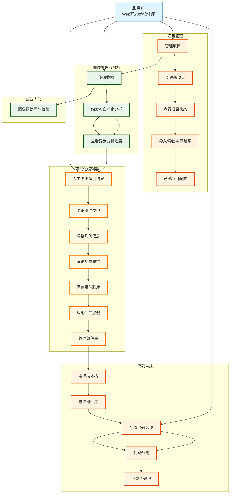
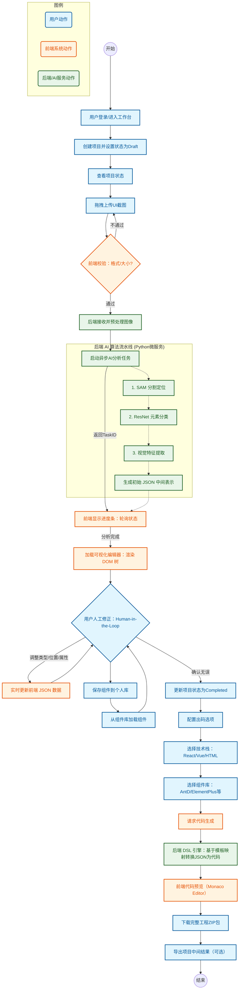

# 需求分析

## 1. 核心用例图 (Core Use Case Diagram)

系统的功能边界，重点突出“人机协同”这一核心需求。

---

## 2. 高层业务流程图 (High-Level Business Process Flow)

用户操作、前端响应和后端 AI 异步处理之间的时序关系。

## 3. 核心功能特性详述

### 3.1 项目状态管理

- **状态流转**：Draft → Analyzing → Completed
- **状态同步**：项目状态与当前活跃任务状态联动
- **状态可视化**：前端实时展示项目进展状态

### 3.2 多阶段AI分析过程

- **阶段1：图像分割** (SAM) - 定位组件边界
- **阶段2：元素分类** (ResNet) - 识别24种组件类型
- **阶段3：特征提取** - 提取8种核心视觉特征
- **进度追踪**：前端通过WebSocket/轮询获取各阶段进度
- **阶段结果存储**：分阶段保存中间结果，支持断点续传

### 3.3 组件库管理系统

- **组件保存**：用户可将编辑好的组件保存到个人库
- **组件复用**：从组件库快速加载常用组件组合
- **组件分类**：支持标签和分类管理
- **组件分享**：支持公开分享高质量组件
- **使用统计**：记录组件使用频率，优化推荐

### 3.4 智能代码生成引擎

- **技术栈选择**：React (UmiJS/Next.js)、Vue 3、原生HTML/CSS
- **组件库映射**：自动映射到对应的UI组件库
- **模板系统**：基于JSON中间表示的DSL转换引擎
- **代码预览**：集成Monaco Editor进行语法高亮预览
- **工程交付**：生成包含完整项目结构的ZIP包

### 3.5 数据导出导入功能

- **中间结果导出**：导出JSON格式的组件坐标、类型、样式数据
- **跨设备迁移**：支持导入中间结果继续编辑
- **版本控制**：记录导出历史，支持多版本管理
- **调试支持**：便于开发阶段的数据分析和问题排查
